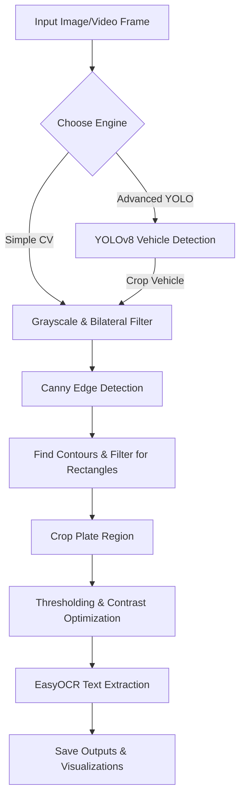

# 🚗 AutoPlate-Detect: AI-powered License Plate Recognition (ALPR)

[](https://www.python.org/)
[](https://opencv.org/)
[](https://github.com/ultralytics/ultralytics)
[](https://github.com/JaidedAI/EasyOCR)
[](https://streamlit.io/)

A complete, dual-engine Automatic License Plate Recognition (ALPR) system. This project can run directly from your terminal or through an interactive, modern web dashboard. It processes static images as well as video streams, isolates plates, extracts their text using OCR, and exports structured reports.

---

## 💡 Why this project? (Two Engines in One)

Most ALPR systems make you choose between heavy deep learning models or fast, traditional image processing. I built this repo to offer **both** approaches so you can compare their strengths:

1. **Simple Mode (Traditional CV):** 
   - No heavy model loading. Uses traditional computer vision algorithms (Grayscale -> Bilateral filtering -> Canny Edge detection -> Contour approximation) to locate rectangular plates.
   - *Best for:* High-contrast plates, low-power hardware, or learning basic OpenCV pipelines.
   
2. **Advanced Mode (YOLOv8 Hybrid):**
   - Uses YOLOv8 (Nano) to detect vehicles first (cars, trucks, motorcycles, buses), then restricts the license plate search to the bounding box of the vehicle.
   - *Best for:* Complex images with cluttered backgrounds where traditional contour detection might fail.

---

## 🛠️ The Under-the-Hood Pipeline

Here is how the images flow through the detector:



---

## 🚀 Key Features

* **Multi-Format Processing:** Detect license plates from `.jpg`, `.png`, and `.jpeg` images or `.mp4`, `.avi`, `.mov` video files.
* **Interactive Dashboard:** Spin up a clean web app using Streamlit to upload files, adjust frame skipping, preview detections live, and download files.
* **Visual Diagnostics:** The scripts automatically export a 6-panel grid showing the step-by-step CV process (Grayscale, Edge detection, Crop, and OCR thresholding) for easier debugging.
* **CSV Logging:** Export a structured log of all license plates detected in videos with timestamps and coordinate bounding boxes.
* **Console Logs:** Detailed terminal logs print in a friendly Hinglish style for quick local debugging.

---

## 📦 Quick Setup

### 1. Clone & Navigate
```bash
git clone <your-repository-url>
cd "number plate detection"
```

### 2. Set Up Virtual Environment (Recommended)
```bash
python -m venv venv
# On Windows
venv\Scripts\activate
# On macOS/Linux
source venv/bin/activate
```

### 3. Install Requirements
```bash
pip install -r requirements.txt
```

### 4. Fetch YOLO Weights & Sample Data
The repository includes dedicated automation scripts to download the pretrained models and copyright-free test vehicle images:
```bash
# Downloads the 6MB YOLOv8n.pt model
python download_yolo_model.py

# Downloads test images into data/images/
python download_test_data.py
```

---

## 🏃 Running the Application

### Option A: The Streamlit Web UI (Recommended)
This runs the web interface where you can upload photos/videos, adjust frames skip logic (great for speeding up video files), and download annotated outputs.
```bash
streamlit run web_app.py
```

### Option B: Command Line Interface (CLI)
You can run the detection logic directly in your terminal. You will be prompted to process either a single file or run a batch scan.

* **Run the OpenCV Contour engine:**
  ```bash
  python simple_detector.py
  ```
* **Run the YOLO engine:**
  ```bash
  python advanced_detector.py
  ```

Outputs will be saved in `data/output/` as cropped plate images, processed full-size images, and diagnostic plots.

---

## 📂 Project Organization

```text
├── data/
│   ├── images/               # Input test images (populated by download_test_data.py)
│   ├── videos/               # Directory to place input videos for testing
│   └── output/               # All processed images, cropped plates, and charts
├── models/                   # Saved model weights
├── utils/                    # Custom helper modules (currently empty)
├── simple_detector.py        # CLI tool for traditional OpenCV detection
├── advanced_detector.py      # CLI tool for YOLOv8 + OCR detection
├── web_app.py                # Streamlit web dashboard source code
├── download_yolo_model.py    # Script to pull YOLO weights
├── download_test_data.py     # Script to pull unsplash sample images
├── requirements.txt          # Python libraries needed
└── README.md                 # This file
```

---

## 🧠 Tips & Troubleshooting

* **Slow First Run?** 
  EasyOCR downloads its PyTorch-based English weights (~100MB) on the very first execution. Give it a minute, subsequent runs are instant.
* **PyTorch Warnings?**
  If you are running on CPU, you might see normal PyTorch warnings about fallback operators. You can safely ignore these; the system automatically falls back to CPU-mode execution without issues.
* **Console Language:**
  The terminal CLI tools print status messages in Hinglish (e.g., `15-20 seconds lagega pehli baar` or `BINA TRAINING ke kaam karega!`). This makes the console pipeline easy to follow and debug!
* **Low Contrast / Bad OCR:**
  EasyOCR performs best on high-resolution text. If character recognition fails, look at the saved visualization files in `data/output/` to inspect `Plate (OCR Input)` and adjust lighting/contrast.

---

## 📝 License
This project is open-source. Feel free to use, modify, and distribute it for personal or educational purposes.
